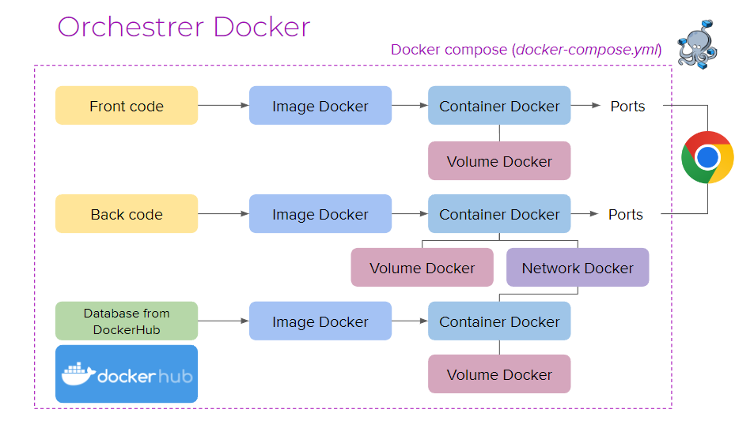

### 3. Concepts de base de Docker

## Images Docker
Une image Docker est un package léger, autonome et exécutable qui inclut tout le nécessaire pour faire fonctionner une pièce de logiciel, y compris le code, un runtime, des bibliothèques et des paramètres de configuration.

Les images sont des exécutables, créées grâce à un Dockerfile
C’est l’équivalent d’une version donnée d’un logiciel

## Conteneurs Docker
Un conteneur est une instance en cours d'exécution d'une image. Les conteneurs sont légers et se lancent rapidement. Vous pouvez créer, démarrer, arrêter, déplacer ou supprimer un conteneur avec des commandes Docker simples.

Les containers sont des exécutions d’image
C’est l’équivalent de l’ouverture d’un logiciel

## Dockerfile
Un Dockerfile est un fichier texte qui contient une série d'instructions pour construire une image Docker. 

La construction d’une image est décrite dans un Dockerfile 

## volume Docker  
Les containers sont des exécutions d’image
C’est l’équivalent de l’ouverture d’un logiciel

## NetWorks docker 
Les networks permettent l’interconnexion de containers

C’est l’équivalent d’un router

## Dockerizer plusieurs apps
Nécessaire pour lancer front et back en même temps  

Nécessite de la synchronisation. On a besoin d’un chef d’orchestre

Plusieurs apps à construire, exécuter et interconnecter avec Docker Compose

# Réutilisation et partage d’images
On peut construire des images depuis notre code

Des images sont déjà disponibles sur les dépôts comme le DockerHub

Surtout pour les gros outils, comme les bases de données

# Conclusion 

Docker nous permet de développer et exécuter des apps dans des environnements connus, définis et stables dans le temps. Docker permet entre autres de faciliter le déploiement, les tests, et bien plus encore ! 

